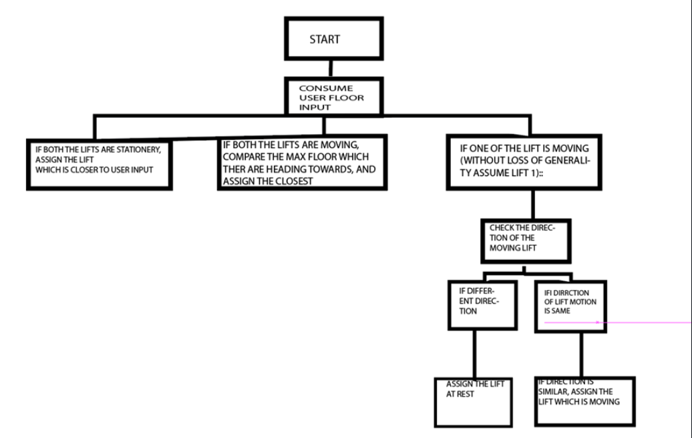
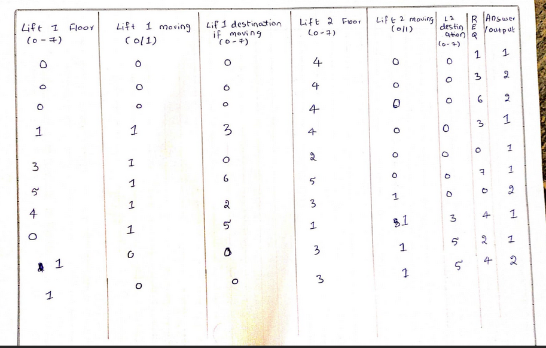
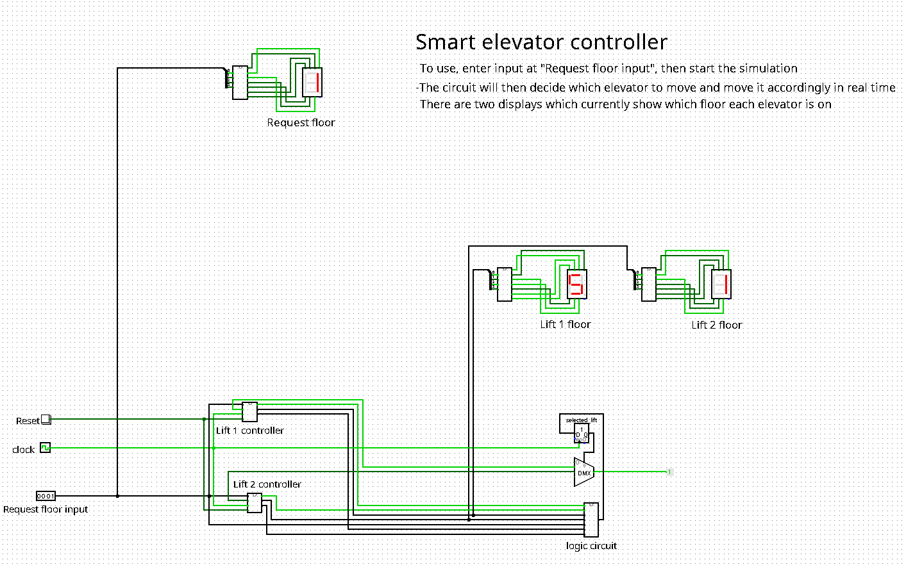
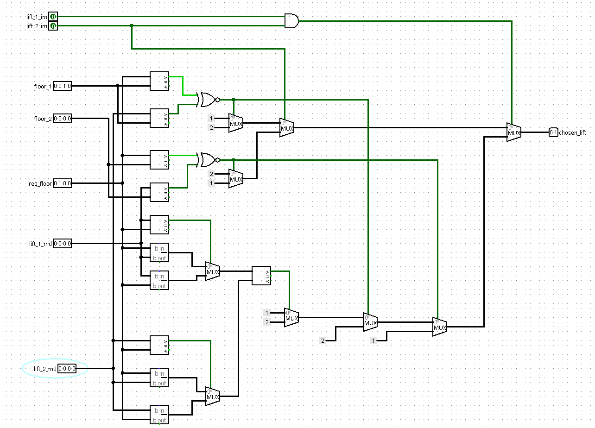
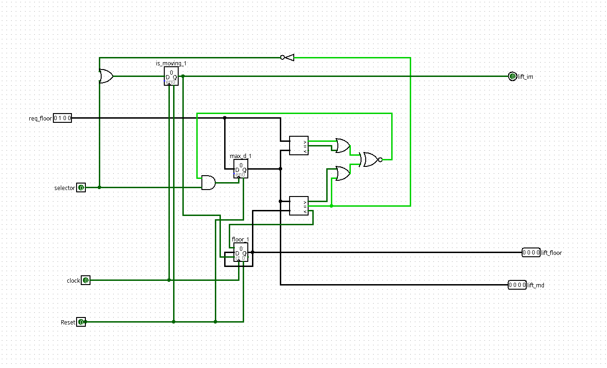

# Elevator scheduling and controlling system

<!-- First Section -->
## Team Details
**Semester:** 3rd Sem B. Tech. CSE

**Section:** S2

**Team Number:** 22

**Member 1:** Prabhanjan B Prabhu, 221CS234, [prabhanjanprabhu.221cs234@nitk.edu.in](mailto:prabhanjanprabhu.221cs234@nitk.edu.in)

**Member 2:** Aditya V Bhagwat, 221CS203, [adityavb.221cs203@nitk.edu.in](mailto:adityavb.221cs203@nitk.edu.in)

<!-- Second Section -->
## Abstract
  
  Multi-storied buildings nowadays generally have elevator systems within them for ease of commutation. 
  
  These elevator systems need precise smart and greedy control to carry out the task assigned to them in a most efficient and time saving manner. In our work, we have focused on developing and implementing an algorithm for elevator control system which can be scaled for an arbitrary “N” floor building’s elevator control as well. 
  
  Our goal is to design and simulate a working elevator system implemented via logic gates utilising our algorithm, and then possibly extend it to multiple lifts together upto an N-storeyed building. 

<!-- Third Section -->
## Working
<details>
  <summary> <b> Details </b> </summary>

  The inputs to the model are the request floor, the current floors in which lift 1 and lift 2 are located, the state of motion of the lifts and their direction of traversal. The model efficiently calculates and allots the best possible lift to the user’s input.

  The model is implemented in verilog mainly using behavioural abstraction, while the main logic is implemented in logisim largely using comparators, adder/subtractors, registers and counters.   
  <br>


<p align="center"> <em> Flowchart for the logic of selecting lift </em> </p>
  <br>  
  <br>  
  

<p align="center"> <em> Table showcasing a variety of testcases </em> </p>

#### Explanation of some test cases
<details>
  <summary>Test case 1</summary>
  Both the lifts are at rest. Lift 1 is situated in floor 0 and Lift 2 in floor 4. The request is from floor 1, which is closer to Lift 1 and hence the output is 1.
</details>

<details>
  <summary>Test case 2</summary>
  Both the lifts are at rest. Lift 1 is situated in floor 0 and Lift 2 in floor 4. The request is from floor 3, which is closer to Lift 2 and hence the output is 2.
</details>

<details>
  <summary>Test case 5</summary>
  Lift 1 is moving and Lift 2 is at rest. Lift 1 is situated in floor 3, and moving towards floor 0, while Lift 2 is at rest in floor 2. The request is from floor 0. Since lift 1 is moving towards floor 0 already, the output is 1.
</details>

<details>
  <summary>Test case 7</summary>
  Both the lifts are in motion. Lift 1 is situated in floor 4 and moving towards floor 2, while Lift 2 is in floor 3 and moving towards floor 0. The request is from floor 0. Both the lifts are moving in the same direction towards 0. Since the destination floor of lift 2 is closer to the request floor, lift 2 is selected.
</details>

<details>
  <summary>Test case 9</summary>
  In this case lift 1 is at rest on floor 1 and lift 2 is moving from floor 3 to floor 1. The request is from floor 5. Since lift 2 is moving in the opposite direction, we select lift 1. 
</details>
</details>

<!-- Fourth Section -->
## Logisim Circuit Diagram
<details>
  <summary> <b> Details </b> </summary>

  
<p align="center"> <em> Main logisim circuit </em> </p>
  <br>  
  <br>  


<p align="center"> <em> Logic for selection of lift </em> </p>
  <br>  
  <br>  


<p align="center"> <em> Circuit to update direction and floor of lifts </em> </p>
  <br>  
  <br>  

</details>

<!-- Fifth Section -->
## Verilog Code
<details>
  <summary> <b> Details </b> </summary>

  The verilog code is given below:  
  <br>

  ```verilog
  
module choose_lift(
    input [2:0] lift1_floor,
    input [2:0] lift1_md,
    input lift1_im,
    input [2:0] lift2_floor,
    input [2:0] lift2_md,
    input lift2_im,
    input [2:0] req_floor,
    output reg [1:0] chosen_lift
);
wire dir1, dir2;
reg [2:0] dif1;
reg [2:0] dif2;
assign dir1 = (lift1_md > lift1_floor);
assign dir2 = (lift2_md > lift2_floor);

always @*
begin

//BOTH ARE AT REST
if(~lift1_im && ~lift2_im) 
begin
    if (lift1_floor == req_floor) 
    begin
        chosen_lift = 2'b01;
    end

    else if (lift2_floor == req_floor)
    begin
        chosen_lift = 2'b10;
    end

    else 
    begin
        if (lift1_floor > req_floor) dif1 <= (lift1_floor - req_floor);
        else dif1 <= (req_floor - lift1_floor);

        if (lift2_floor > req_floor) dif2 <= (lift2_floor - req_floor);
        else dif2 <= (req_floor - lift2_floor);

        if (dif1 < dif2) chosen_lift = 2'b01;
        else chosen_lift = 2'b10;
    end
        end


        //BOTH ARE MOVING
        if(lift1_im && lift2_im) 
        begin
            if ((req_floor > lift1_floor) == dir1) chosen_lift = 2'b01;
            else if ((req_floor > lift2_floor) == dir2) chosen_lift = 2'b10;

            else
            begin 
            if (lift1_md > req_floor) dif1 = lift1_md - req_floor;
            else dif1 = req_floor - lift1_md;

            if (lift2_md > req_floor) dif2 = lift2_md - req_floor;
            else dif2 = req_floor - lift2_md;

            if (dif1 < dif2) chosen_lift = 2'b01;
            else chosen_lift = 2'b10;

        end
end

//one moving, one not
else
begin
    if(lift1_im)
    begin
        if ((req_floor > lift1_floor) == dir1) chosen_lift = 2'b01;
        else chosen_lift = 2'b10;
    end

else
begin
    if ((req_floor > lift2_floor) == dir2) chosen_lift = 2'b10;
    else chosen_lift = 2'b01;
end
        end
    end
    endmodule


module update_lifts(
        output reg [2:0] lift1_floor,
        output reg [2:0] lift1_md,
        output reg lift1_im,
        output reg [2:0] lift2_floor,
        output reg [2:0] lift2_md,
        output reg lift2_im,
        output reg [2:0] req_floor
    );

    wire [1:0] chosen_lift;
    reg [1:0] lift_choice;
    choose_lift cl(lift1_floor, lift1_md, lift1_im, lift2_floor, lift2_md, lift2_im, req_floor, chosen_lift);
    initial
    begin
        lift_choice[0] = chosen_lift[0];
        lift_choice[1] = chosen_lift[1];
    end


    always @*
    begin

    if (req_floor > 3'b101) lift_choice = 2'b00;


    if (lift_choice == 1)
    begin
        if(~lift1_im)
        begin
            lift1_md = req_floor;
            lift1_im = 1;
        end

        else
        begin
            if(lift1_md > lift1_floor) 
            begin
                if (req_floor > lift1_md) lift1_md = req_floor;
            end

        else if (req_floor < lift1_md) lift1_md = req_floor;
    end
    end

    if (lift_choice == 2)
    begin
        if(~lift2_im)
        begin
            lift2_md = req_floor;
            lift2_im = 1;
        end

        else
        begin
            if(lift2_md > lift2_floor) 
            begin
                if (req_floor > lift2_md) lift2_md = req_floor;
            end

        else if (req_floor < lift2_md) lift2_md = req_floor;
    end
    end


    if(lift1_im) 
    begin
        lift1_floor += (lift1_md > lift1_floor);
        lift1_floor -= (lift1_md < lift1_floor);
    end

    if(lift2_im) 
    begin
        lift2_floor += (lift2_md > lift2_floor);
        lift2_floor -= (lift2_md < lift2_floor);
    end
end

endmodule;


  ```
</details>

<!-- Sixth Section -->
## References and sources
<details>
  <summary><b>Details</b></summary>

- [Behavioural modeling in verilog](https://www.javatpoint.com/verilog-behavioral-modelling-and-timing)
- [Electronics stackexchange](https://electronics.stackexchange.com/)
- [Kumar, Manish & Singh, Priyanka & Singh, Shesha. (2017). A VLSI Implementation of Four-Phase Lift Controller Using Verilog HDL. IOP Conference Series: Materials Science and Engineering.](https://www.researchgate.net/publication/319597836_A_VLSI_Implementation_of_Four-Phase_Lift_Controller_Using_Verilog_HDL)
</details>
